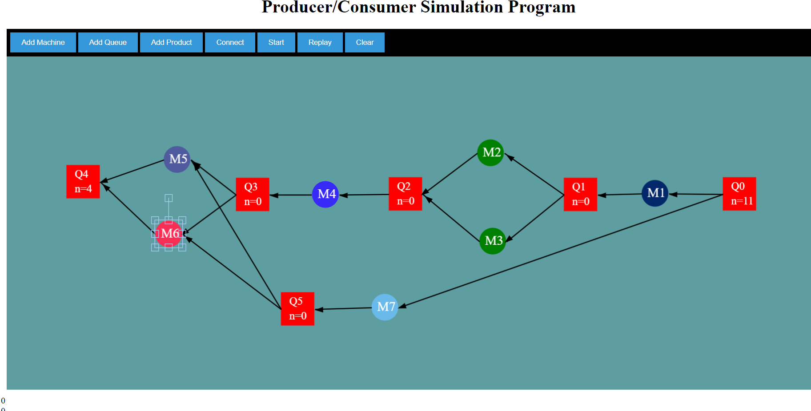

# Producer/Consumer Simulation Program
## Description
An assembly line that produces different products consists of different processing machines Ms that are responsible for processing the product at different stages and queue Qs to handle product movement
between different processing stages (see figure below). In this assignment, we will develop a simulation program to simulate this production line as a queuing network.

## Features
The simulation system support the following features
- Users can graphically add Qs and Ms, connect them via UI arbitrarily.
- The input (products arriving at Q0 to get processed) has a random input rate.
- Each M has a random service time and can serve one product at a time. Once completed, it needs to check the queue if waiting products need to be consumed, if not then it needs to register
- itself to the queue as ready (Hint: check observer design pattern).
- Each machine is running and processing its products on a separate thread different from other machines’ processing threads. The UI shows the simulation by displaying the number of elements in the Qs in real time.
- Ms flash when they finish servicing an item and every product has its own color (a random color) that will keep it from start till the end and each machine will change its color the product’s
- color being processed by it then change back to a default color once done to make following the simulation easy for the user.
- After the simulation ends, the user can start a new simulation or replay the previous simulation

